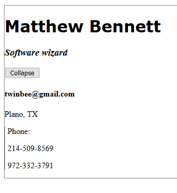
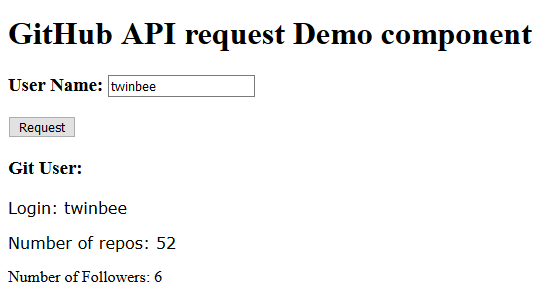

# tryAngular
Working through the JavaBrains.io Angular 6 Basics course found here: [http://javabrains.io]

## Prerequisites

I am using Node.js v10.15.0 (in January 2019). 

Install mode.js, then install the angular2+ family's command-line interface (CLI) with 
```
npm install @angular/cli
```

## Usage

In a command prompt, cd into one of the projects such as first-project, then
```
ng serve
```

You should then be able to find the Angular application in a test web server at [http://localhost:4200]

# Contents

There are three practice angular projects defined here: first-project, project, and routing.

## first-project

Contains a hello world component describing the minimum files structure needed for an Angular component. 


Contains a component called "date" to display a date and time which updates automatically on each second using the angular ngInterval registered callback function / lambda.

Contains a component called "address-card" to display class member data about an address, telephone number etc (directory services type information). The module uses ng directives like ngFor and ngIf, tag inputs (e.g. page-specified name on the address card), and CSS stying.



Contains a demonstration of how to use two-way data binding with ngModule to change the contents of a simple data field.

## project

Contains an example module/component breakdown to show how to organize multiple modules each containing components.

Contains an example "injectable" angular service for printing to the developer web-console.

Contains an example for sending REST API calls using HttpClient to the GitHub API. The results are displayed within an angular component.




## routing

TODO


##
## Angular 6 Basics  (Angular not Angular.JS because it is written in

## typescript.)

Learn how to use and build applications in the Angular framework. This is a &#39;from the basics&#39; introduction to Angular that covers various features of the framework, as well as how to create run and deploy a web application with Angular

This course covers:

- Understanding the component model approach to building Angular applications
- Creating components and building component trees
- Implementing interactivity by responding to user events
- Building an application using services
- Breaking the Angular application into modules
- Making REST API calls using in-built services
- Implement routing to build multi-view applications

**UNIT**

# 1

#### Components

This unit is an introduction to the Angular framework. This covers an introduction to the mental model, setting up Angular and introduces components - the fundamental building blocks of an Angular application.

### 1.1 Introduction

Welcome to this course. We&#39;ll look at what this course covers and how its contents are organized.

### 1.2 Component Based Model

Understand the component-based mental model that&#39;s helpful when thinking about Angular application development.

###
1.3 Setting Up

Let&#39;s setup the development environment to run Angular applications. This includes NodeJS, the editor (Visual Studio Code) and the Angular CLI.

### 1.4 Creating and running a project

Learn how to use the Angular CLI&#39;s `ng new` command to create a new Angular project. Then use the `ng serve` command to run the project and access it in a browser.

###
1.5 Introducing the app component

Let&#39;s examine the root component of teh generated Angular CLI project - the `app` component.

###
1.6 Creating your first component

Create a component from scratch using the Angular CLI&#39;s `generate` command. Understand what that command does and examine the resulting files.

### 1.7 Anatomy of a component

We&#39;ll create a new &#39;date&#39; component and break down the component files into its essential elements in order to examine them. We&#39;ll learn how the `@Component` decorator instructs Angular where to look up the markup HTML file for the component.

### 1.8 Binding data from component class

Learn how to bind data from a member variable of the component to the view. We&#39;ll implement the functionality of the date component to show the current date as the Angular application is loaded.

### 1.9 Data binding and async

In this video we&#39;ll use an async operation (`setInterval`) to dynamically update the date component&#39;s displayed value, so that it shows updates to the time value every second.

### 1.10 Template Interpolation

Let&#39;s examine the template interpolation expression (the &#39;double-curly&#39;) and the ways you can bind and evaluate data and expressions. We&#39;ll try out using arithmetic expressions, method calls and access member variables in dynamic expressions.

**UNIT**

# 2

#### Templates and Data Binding

Explore more template syntax and features like ngIf, component styling and inputs/outputs. Learn how two way data binding works with ngModel. Understand what Angular modules are.

###
2.1 Looping with ngFor

In this unit, we&#39;ll look at the ways you can customize your view by using the directives and template interpolation features of the Angular framework. We&#39;ll start by examining the directive `ngFor` that lets you loop over an array in the view.

###
2.2 Using ngIf

Learn how to conditionally include DOM elements in your component based on component data using the `ngIf` directive.

### 2.3 Passing inputs to components

Learn how to pass data to your components to &#39;parameterize&#39; them. Use the `@Input()` decorator to designate a component member variable as an input and thus configure the component API.

### 2.4 Using ngOnInit Lifecycle hook

Learn about life cycles of an Angular component and how you can write methods that execute when certain life cycles are triggered. Here we&#39;ll use the `ngOnInit` lifecycle hook to execute code when the component is initialized.

###
2.5 Passing member variables to components

We&#39;ll continue exploring parameter passing to components - this time as an object instance. Learn the difference between passing a literal value and passing a member variable of the component using the `[]` to force value resolution.

### 2.6 Styling Angular components

Learn how to add styling to your Angular components. Understand how Angular manages styling by encapsulating CSS classes and how it affects the way you style your Angular components.

### 2.7 Handling click events

We&#39;ll now implement some interactivity by adding a button and having its click event trigger showing and hiding of a div. You&#39;ll learn how to wire in member methods to be executed on user events and how you can affect component state with them.

###
2.8 Two way data binding with ngModel

Learn how to use the `ngModel` directive to achieve two way data binding between the view and the component class. Learn how to bind a text input element to a member variable of your component class.

**UNIT**

# 3

#### Services

Learn about services in Angular. Create services and inject them into components using dependency injection. Use the HttpClient service to make REST API calls and receive responses.

### 3.1 Creating and using multiple modules

We&#39;ll now examine the module file we&#39;ve ignored all along in this course. You&#39;ll understand what Angular modules are and how you need to declare components that you need to be a part of a module. Learn how the decorator `NgModule` makes a class an Angular module.

### 3.2 Creating a service

In this unit, we&#39;ll learn about services and how to use them. In this video, we&#39;ll use the Angular CLI to create a new service. Learn how to specify them in the `Providers` section of `NgModule`. And use `@Injectable` to decorate a service.

### 3.3 Understanding dependency injection

Understand how dependency injection works and how Angular uses the concept of dependency injection to inject service instances to the code that needs them. See how it compares to an alternative &#39;lookup&#39; approach and some benefits of the dependency injection approach.

###
3.4 Service Injection Context

Learn how Angular maintains a shared injection context where services are injected. This leads to some &#39;quirks&#39; in the behavior of dependency injection that you should be aware of.

### 3.5 Making REST calls with HttpClient

Learn how to use the inbuilt service `HttpClient` to make REST API calls and get data from external APIs.

###
3.6 Extending the sample app

In this video, we&#39;ll put some of the concepts we&#39;ve learnt into practice by creating a Github profile lookup application in Angular. Watch me code an app that makes REST calls to the Github API and looks up user information.

###
3.7 Building an Angular project

Learn how to build an Angular project to make it ready to be deployed on a CDN or hosted. Understand the difference between hosting an Angular app this way when compared to doing an `ng serve`.

**UNIT**

# 4

#### Routing

Create and manage multiple views and routes using the Angular Router. Learn how to configure routes, hook them to different root components and switch between routes using routerLink.

### 4.1 Introduction to Routing

Understand the concept of routing in Angular. Learn about URL-based and component-based routing and how the Angular routing framework puts those two together to map route URLs to root components.

### 4.2 Creating an angular project with routing

Use the `--routing` parameter when generating an Angular CLI project to create some basic routing support in your project. Examine the additional code generated.

### 4.3 Creating routes

Let&#39;s create a couple of routes and map them to components as we learn how to configure them. Use an array of `Route` object instance and pass them to the `RouterModule.forRoot()` method.

### 4.4 Route redirects and wildcards

Learn how to redirect from one route to another using the `redirectTo` property of the `Route` object. Also use wildcard path mappings to handle cases of invalid routes.

### 4.5 Configuring child routes

Learn how to create and configure nested routes. Learn to use the `children` property of the `Route` class to specify child routes. Also, use the `router-outlet` component to show the child routes at the right location.

### 4.6 Showing navigation for routes

Learn how to show navigation links in your components to allow users to switch between routes in your app. Understand how using `href` doesn&#39;t work and why you need to use the `routerLink` directive instead.

### 4.7 Wrap Up

Let&#39;s wrap up this course not by looking back, but by looking ahead at the next steps that&#39;s recommended for you in your journey of learning Angular.